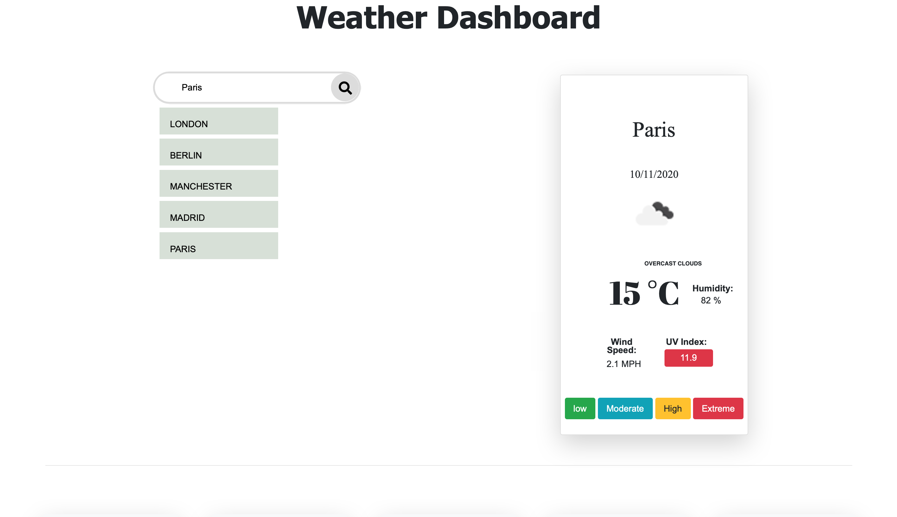
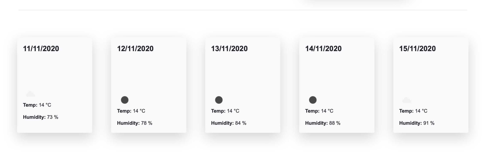

# Weather-dashboard

The aim of this assignment is to create a weather dashboard using the open weather API in order to gather the latest and most accurate weather information for the current weather, uv index and the weather for the next five days. The use of local storage allows the user to save and display any city they have on the user interface (UI). 

See the deployed app here: https://sumaya198.github.io/Weather-dashboard/#
 
 
 