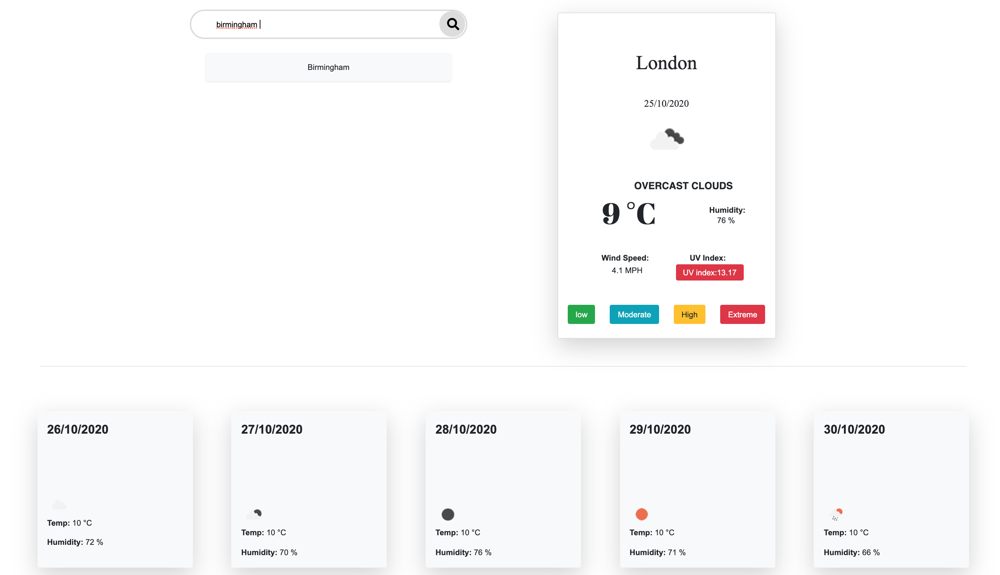

# Weather-dashboard

 This weather dashboard allows the user to input a city name and the the date, temperature, uv index and humidity is displayed. The weather for future dates are also diplayed. 

## Challenges, Opportunities for Improvement
This app was created using the Open Weather Map data API. In order to get all the information needed, a good deal of manipulation of the response from the get request was needed, including taking information from one response to generate a new request. For example, the initial search based on city name returns latitude and longitude coordinates, and these coordinates are used in the UV Index get request.

One feature I will need to work on is storing the searched cities into local storage and displaying the searched cities on the browser.

 See the deployed app here: https://sumaya198.github.io/Weather-dashboard/
 
 